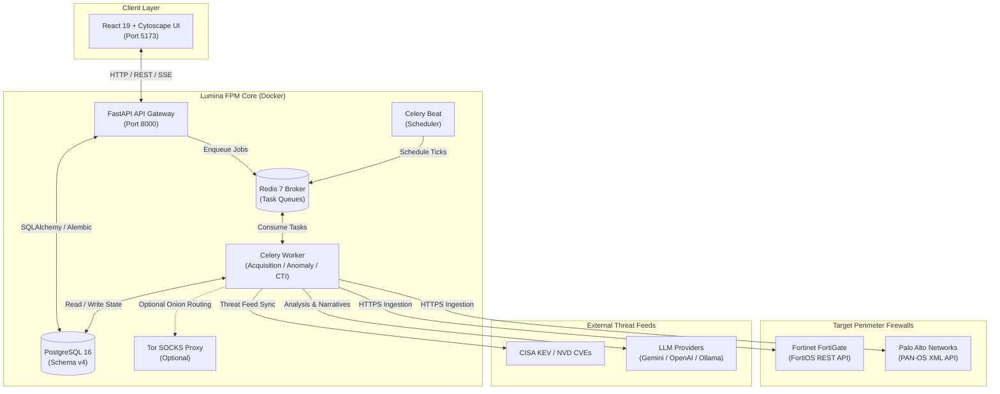

# 🛡️ Lumina FPM (Firewall Policy Manager)

[](https://www.python.org/)
[](https://fastapi.tiangolo.com/)
[](https://react.dev/)
[](https://vitejs.dev/)
[](https://www.postgresql.org/)
[](https://docs.celeryq.dev/)
[](https://www.docker.com/)
[](#-architecture--technology-stack)

> **Lumina FPM** is an enterprise-grade, proactive platform for acquiring, normalizing, analyzing, and visualizing multi-vendor firewall policies (Palo Alto Networks & Fortinet) with integrated deterministic anomaly detection and version-aware Cyber Threat Intelligence (CTI).

---

## 📑 Table of Contents

- [Overview](#-overview)
- [Key Features](#-key-features)
- [Architecture & Technology Stack](#-architecture--technology-stack)
- [System Architecture](#-system-architecture)
- [Repository Structure](#-repository-structure)
- [Quick Start Guide](#-quick-start-guide)
  - [Prerequisites](#prerequisites)
  - [Step 1: Clone Repository](#step-1-clone-repository)
  - [Step 2: Environment Configuration](#step-2-environment-configuration)
  - [Step 3: Launch with Docker Compose](#step-3-launch-with-docker-compose)
  - [Step 4: Verify Deployment](#step-4-verify-deployment)
- [Core Endpoints & API Reference](#-core-endpoints--api-reference)
- [Configuration Reference](#-configuration-reference)
- [Development & Testing](#-development--testing)
- [Contribution Guidelines](#-contribution-guidelines)
- [Security & Compliance](#-security--compliance)
- [License & Support](#-license--support)

---

## 🌟 Overview

Modern enterprise network perimeters frequently suffer from policy sprawl: thousands of rules accumulated across heterogeneous firewall vendors (Fortinet FortiOS, Palo Alto Networks PAN-OS). Over time, this leads to **shadowed rules**, **unintended access**, **performance degradation**, and **audit non-compliance**.

**Lumina FPM** eliminates policy drift through:
- **Direct, Agentless Ingestion:** Automated policy acquisition via vendor-native APIs without modifying or pushing to production firewalls (strictly read-only).
- **Canonical Schema v4 Normalization:** A single unified relational model for rules, security zones, network objects, and service groups.
- **Mathematical Anomaly Detection:** Formal set-theoretic analysis identifying shadowing, redundancy, overlaps, and conflicts.
- **Dynamic Threat Intelligence (CTI):** Real-time mapping of CISA KEV and NVD CVE advisories against installed firmware versions and active policy configurations.
- **Interactive Policy Topology:** Logical network graph visualization to trace end-to-end traffic allowances across multi-firewall topologies.

---

## ⚡ Key Features

| Capability | Description |
|---|---|
| **🔄 Multi-Vendor Policy Acquisition** | Native connectors for **Fortinet (FortiOS REST API)** and **Palo Alto Networks (PAN-OS XML API)** with encrypted credential management. |
| **📐 Schema v4 Normalization** | Converts disparate vendor structures into canonical relational entities with exact CIDR and port interval mathematics. |
| **🔍 Deterministic Anomaly Engine** | Zero-mock mathematical rule relation engine detecting **Shadowing**, **Redundancy**, **Correlation**, **Generalization**, and **Overlaps/Conflicts**. |
| **🕸️ Logical Policy Topology** | Interactive network policy graph powered by **Cytoscape.js** and **Dagre** layout engine for intuitive rule traversal. |
| **🛡️ CTI & Risk Scoring** | Multi-factor risk engine aggregating policy anomalies with **CISA KEV** and **NVD CVE** data matched to installed firmware releases. |
| **⏱️ Asynchronous Task Pipeline** | Robust background workers orchestrated via **Celery & Redis** for scheduled acquisitions, batch analyses, and report generation. |
| **🤖 AI-Assisted Operations** | Abstracted LLM integration (**Gemini**, **OpenAI**, **Anthropic**, **Ollama**) for natural-language policy queries, SOC summaries, and remediation guidance. |
| **🔐 Role-Based Security** | Fernet encryption for device secrets at rest, JWT authentication, granular RBAC, and immutable audit logging. |

---

## 🏗️ Architecture & Technology Stack

Lumina FPM is engineered as a containerized microservices suite:

| Component | Technology | Role | Port |
|---|---|---|---|
| **Frontend** | React 19, TypeScript, Vite, TailwindCSS | Web UI, Policy Explorer, Interactive Topology Graph | `5173` |
| **Backend API** | FastAPI, Python 3.11, Pydantic, SQLAlchemy | REST API Gateway, Business Logic, Auth, RBAC | `8000` |
| **Worker Engine** | Celery 5.x, Python 3.11, Watchdog | Background task processing, policy ingestion, anomaly runs | Internal |
| **Scheduler** | Celery Beat | Automated cron execution for device polling & CTI sync | Internal |
| **Message Broker** | Redis 7 Alpine | Celery task queue broker and results caching | `6379` (Internal) |
| **Database** | PostgreSQL 16 Alpine, Alembic | Primary relational persistence, Schema v4 migrations | `5432` (Internal) |
| **Tor Proxy** | SOCKS5 Proxy (Optional) | Dark-web threat intelligence feeds routing (disabled by default) | `9050` |

---

## 📊 System Architecture



---

## 📁 Repository Structure

```text
lumina-fpm/
├── backend/                  # FastAPI backend services & Celery workers
│   ├── alembic/              # Database schema migration revisions
│   ├── api/                  # API routers (devices, policies, anomalies, CTI, etc.)
│   ├── core/                 # Configuration, logging, encryption, and security
│   ├── models/               # SQLAlchemy ORM models & CRUD operations
│   ├── services/             # Core engines: acquisition, parsing, anomaly, risk, CTI
│   ├── celery_app.py         # Celery task registration & broker bindings
│   ├── entrypoint.sh         # Docker boot script (Alembic migrate & Uvicorn startup)
│   ├── main.py               # Application entry point & router aggregation
│   └── requirements.txt      # Python dependencies
├── frontend/                 # React 19 + TypeScript + Vite frontend
│   ├── src/                  # Components, topology graph, pages, and hooks
│   ├── package.json          # Frontend packages & scripts
│   └── vite.config.ts        # Vite build & proxy configuration
├── docs/                     # Architectural decisions (ADRs) & specification docs
├── lab/                      # Lab environment topology & test fixtures
├── tor-proxy/                # Dockerfile and configuration for SOCKS proxy
├── docker-compose.yml        # Multi-container orchestration definition
├── .env.example              # Template environment variables
└── Readme.md                 # Primary project documentation
```

---

## 🚀 Quick Start Guide

### Prerequisites

Ensure you have the following installed on your host system:
- **[Docker Desktop](https://www.docker.com/products/docker-desktop/)** (version 24.0+ or Docker Engine with Docker Compose v2)
- **Git** (version 2.30+)

> [!NOTE]
> You do **not** need to install Python, Node.js, or PostgreSQL locally on your host. All dependencies and runtimes are isolated within Docker containers.

---

### Step 1: Clone Repository

```bash
git clone https://github.com/kandeel679/lumina-fpm.git
cd lumina-fpm
```

---

### Step 2: Environment Configuration

Create a local `.env` file from the provided template:

```bash
cp .env.example .env
```

Generate a secure Fernet key for encrypting device credentials in PostgreSQL:

```bash
python -c "from cryptography.fernet import Fernet; print(Fernet.generate_key().decode())"
```

Update your `.env` file with:
1. `ENCRYPTION_KEY`: Set to the output generated above.
2. `SECRET_KEY`: Set to a strong random string for JWT session security.
3. `POSTGRES_PASSWORD`: Configure your local database password.
4. `LLM_API_KEY`: Provide your Gemini, OpenAI, or Anthropic API key if using AI assistance.

---

### Step 3: Launch with Docker Compose

Build and launch all services in detached mode:

```bash
docker compose up --build -d
```

To tail the logs and monitor the startup sequence:

```bash
docker compose logs -f api
```

The container entrypoint will automatically execute database migrations (`alembic upgrade head`) before starting the web server.

---

### Step 4: Verify Deployment

Once initialized, access the following endpoints:

| Service | URL | Description |
|---|---|---|
| **Frontend Web App** | [http://localhost:5173](http://localhost:5173) | Main dashboard, policy explorer, and network graph |
| **API Root** | [http://localhost:8000](http://localhost:8000) | REST API status |
| **Interactive API Docs** | [http://localhost:8000/docs](http://localhost:8000/docs) | Swagger UI for exploring and testing API endpoints |
| **Alternative API Docs** | [http://localhost:8000/redoc](http://localhost:8000/redoc) | ReDoc formatted API documentation |
| **Health Check** | [http://localhost:8000/health](http://localhost:8000/health) | API health verification |

To shut down the platform:

```bash
docker compose down
```

---

## 🔌 Core Endpoints & API Reference

All core endpoints are versioned under `/api/v1` (with standard top-level redirects):

| Method | Endpoint | Description |
|---|---|---|
| `GET` | `/devices` | List registered firewall inventory (FortiOS / PAN-OS) |
| `POST` | `/devices` | Register a new firewall device |
| `POST` | `/devices/{id}/credentials` | Set or update encrypted device API credentials |
| `POST` | `/devices/{id}/test-connection` | Validate API reachability without exposing secrets |
| `POST` | `/devices/{id}/poll` | Trigger an asynchronous policy acquisition Celery task |
| `GET` | `/policies` | Search and filter normalized policies across all firewalls |
| `GET` | `/anomalies` | Query detected policy anomalies (Shadowing, Redundancy, Conflicts) |
| `POST` | `/anomalies/run` | Trigger an on-demand anomaly detection execution run |
| `GET` | `/risks` | Retrieve composite risk scoring per device and rule |
| `GET` | `/cti/indicators` | Inspect extracted threat indicators and matched CVEs |
| `GET` | `/jobs/{job_id}` | Monitor background Celery task progression |
| `GET` | `/health` | Application health and status verification |

---

## ⚙️ Configuration Reference

Key environment variables defined in `.env`:

| Variable | Default Value | Description |
|---|---|---|
| `ENVIRONMENT` | `development` | Deployment tier (`development`, `lab`, `staging`, `production`) |
| `DATABASE_URL` | `postgresql://lumina:...@db:5432/lumina_fpm` | Connection string for PostgreSQL |
| `REDIS_URL` | `redis://redis:6379/0` | Connection string for Celery message broker |
| `ENCRYPTION_KEY` | *(Required)* | 32-byte Fernet key for symmetric device credential encryption |
| `SECRET_KEY` | *(Required)* | Secret key for signing session tokens and API auth |
| `FIREWALL_TLS_VERIFY`| `true` | Enforce SSL/TLS certificate validation for firewall endpoints |
| `LLM_PROVIDER` | `gemini` | Configured AI provider (`gemini`, `openai`, `ollama`, `anthropic`) |
| `ENABLE_DARKWEB_INTEL` | `false` | Enable/disable optional Tor SOCKS proxy and onion scraper |

---

## 🛠️ Development & Testing

### Live Reloading in Containers

The development environment is configured for real-time hot reloading:
- **Frontend:** Vite HMR (Hot Module Replacement) watches changes in `./frontend/src`.
- **Backend API:** Uvicorn runs with `--reload`, mounting `./backend` into `/app`.
- **Celery Worker:** Integrated with `watchdog` (`watchmedo`) to automatically restart worker processes upon Python code modifications.

### Running Test Suites

Execute unit and integration tests inside the running API container:

```bash
# Execute pytest suite
docker compose exec api pytest

# Execute threat intelligence pipeline validation
docker compose exec api python services/lumina_threat_intel/test_ground.py
```

---

## 🤝 Contribution Guidelines

To maintain code quality and stability across the project:

1. **Branching Strategy:**
   - **Never push directly to `main`**.
   - Create a feature or bugfix branch:
     ```bash
     git checkout -b feature/your-feature-name
     # or
     git checkout -b bugfix/issue-description
     ```
2. **Pull Requests:**
   - Open a PR against `main` once tested.
   - Complete the pull request template with test results and verification logs.
   - Ensure all Docker builds pass and no regressions occur in Alembic migrations.
3. **Coding Standards:**
   - Follow PEP 8 guidelines for Python code.
   - Maintain strict type annotations (`pydantic` models for API contracts, TypeScript interfaces in frontend).
   - Zero hardcoded credentials or plaintext secrets.

---

## 🔒 Security & Compliance

- **Read-Only Operation:** Lumina FPM is designed for inspection and reporting. It **never** writes, pushes, or modifies running firewall configurations.
- **Credential Storage:** All device API tokens and credentials are encrypted at rest using AES-128-CBC with HMAC-SHA256 authenticated Fernet tokens.
- **Network Isolation:** PostgreSQL and Redis containers do not expose external host ports by default; communication is restricted to the internal Docker bridge network.
- **Safe Parsing:** Hardened XML (`defusedxml`) and JSON deserialization protect against billion-laughs and injection attacks during policy ingestion.

---

## 📄 License & Support

Distributed under the terms of the private project license for Lumina FPM.

For questions, issues, or feature requests, contact the project maintainer:
- **Project Lead:** [@kandeel679](https://github.com/kandeel679)
